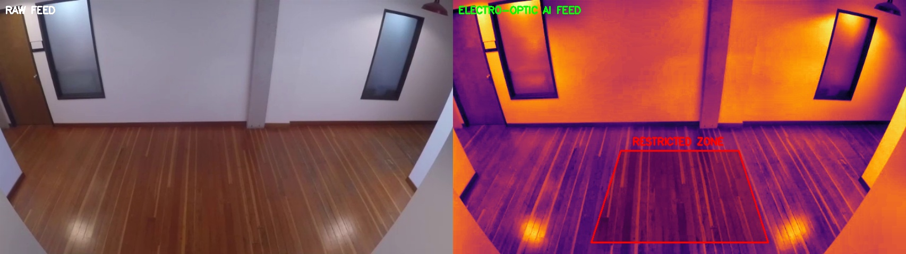

# Low-Light Electro-Optic Object Tracking Pipeline

Real-time smart surveillance system that combines **low-light image enhancement** with **AI-powered object detection and tracking** for intrusion detection in restricted zones.

## Project Demo



## Features

- **Low-Light Image Enhancement**: CLAHE (Contrast Limited Adaptive Histogram Equalization) for visibility improvement in dark/low-light conditions
- **Pseudo-Thermal Imaging**: Infrared-style colormap simulation for electro-optic visualization
- **Real-Time Object Detection**: YOLOv8 nano model for fast and accurate person detection
- **Persistent Object Tracking**: ByteTrack algorithm assigns unique IDs to track individuals across frames
- **Restricted Zone Intrusion Detection**: Polygon-based virtual boundary with automated visual alerts
- **Split-Screen Display**: Side-by-side view of raw camera feed vs. AI-enhanced electro-optic feed
- **Real-Time FPS Counter**: Performance monitoring overlay

## Tech Stack

| Component | Technology |
|---|---|
| Language | Python 3.8+ |
| Computer Vision | OpenCV 4.x |
| Object Detection | YOLOv8 (Ultralytics) |
| Object Tracking | ByteTrack |
| Image Enhancement | CLAHE, Colormaps |
| Numerical Computing | NumPy |

## Installation

```bash
# Clone the repository
git clone https://github.com/haricharanv/Smart-Surveillance-YOLOv8.git
cd Smart-Surveillance-YOLOv8

# Install dependencies
pip install ultralytics opencv-python numpy
```

## Usage

```bash
python smart_surveillance.py
```

- The system will open your webcam and display a split-screen view
- **Left**: Raw camera feed
- **Right**: Electro-optic AI feed with detections, tracking, and zone alerts
- Press **'q'** to quit

## Pipeline Architecture

```
Webcam Feed
    │
    ├──► Raw Frame (Left Display)
    │
    ▼
CLAHE Enhancement
    │
    ▼
Thermal Colormap
    │
    ▼
YOLOv8 Detection ──► ByteTrack Tracking
    │                       │
    ▼                       ▼
Restricted Zone     Persistent IDs
Check                    │
    │                       │
    ▼                       ▼
Intrusion Alert ◄── Annotated Frame (Right Display)
    │
    ▼
Split-Screen Output
```

## Configuration

Key parameters can be adjusted at the top of `smart_surveillance.py`:

| Parameter | Default | Description |
|---|---|---|
| `CONFIDENCE_THRESHOLD` | 0.45 | Minimum detection confidence |
| `CLAHE_CLIP_LIMIT` | 3.0 | Contrast enhancement strength |
| `THERMAL_COLORMAP` | INFERNO | Pseudo-thermal color scheme |
| `TARGET_CLASSES` | [0] (person) | COCO classes to detect |

## Applications

- Defense surveillance and perimeter security
- Critical infrastructure monitoring
- Low-light and night-vision object tracking
- Restricted area access control

## License

MIT License
